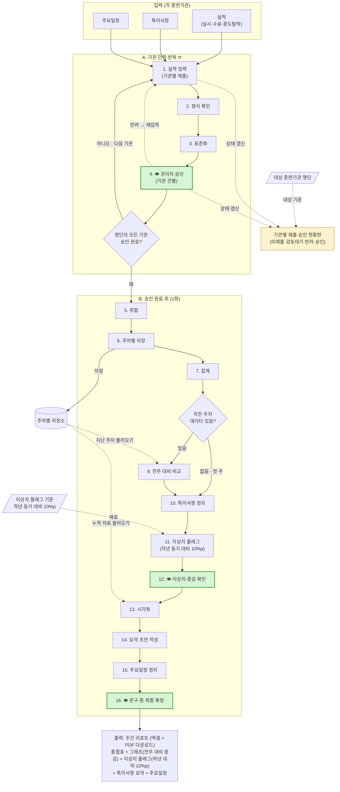

# 주간 훈련기관 교육실적 취합·특이사항·시각화 — 자동화 흐름도

> 작성일: 2026-07-22 (대상 명단·첫 주 분기·이상치 확인 지점 반영 개정)
> App 대상: [주간 훈련기관 교육실적 취합·특이사항·시각화]
> 구성: 입력 → 처리(단계별) → 출력 · 위에서 아래로 읽기
> 👁 = 사람(관리자)이 판단하는 지점 = **"여기서 내가 한 번 확인"**

---

## 1. 입력 (App이 받는 것)

**각 훈련기관이 입력하는 값**
- **실적** (실시인원 · 수료인원 · 중도탈락자) — 하나의 실적 항목으로 통합 기재
- 특이사항 (기관이 보고한 이슈·비고)
- 주요일정 (개강·종강·점검 등 예정 일정)

**설정 / 저장소 (반복 비교·판정에 필요한 재료)**
- **대상 훈련기관 명단** (이번 주 제출 대상 기관 목록) — *미제출·승인 완료율 계산의 기준. 이게 있어야 "안 낸 기관"을 알 수 있음*
- 이상치 플래그 기준 — **작년(전년 동기) 자료 대비 10%p 이상 차이** *(플래그 판정의 재료)*
- 주차별 저장소 — *확정된 주차 데이터가 쌓이는 곳(전년 동기 자료 포함). 전주 대비·시각화는 여기서 자동으로 불러옴*

---

## 2. 처리 (한 단계 = 한 가지 일)

**[A. 기관 단위 반복 ⟳ — 기관마다 제출·검토·승인]**

1. **실적 입력** — 한 기관이 실적(실시·수료·중도탈락)·특이사항·주요일정을 **엑셀 업로드**로 제출
2. **형식 확인** — 제출 건의 양식·필수항목 누락/오류 점검
3. **표준화** — 항목명·단위·날짜 형식을 하나로 통일
4. **👁 관리자 승인 (기관 건별)** — 해당 기관 입력값을 확인·수정 후 승인 → **여기서 내가 한 번 확인** *(기관마다 반복 / 반려 시 그 기관에 재입력 요청)*
   - ↺ 제출·승인 상태는 매 건 **현황판**에 실시간 반영 (*대상 명단* 대비 미제출·완료율 자동 계산)
   - → 대상 명단 중 아직 승인 안 된 기관이 남으면 **1번으로 돌아가 다음 기관 처리**
   - → 명단의 모든 기관 승인 완료되면 **B로 진행**

**[B. 모든 기관 승인 완료 후 — 한 번만 실행]**

5. **취합** — 승인된 기관 입력을 하나의 통합표로 병합
6. **주차별 저장** — 확정 통합본을 이번 주차 데이터로 저장소에 저장
7. **집계** — 이수율·탈락률 등 지표 계산
8. **직전 주차 확인** — 저장소에 지난 주차 데이터가 있는지 판단 *(분기)*
   - **있음** → 9단계(전주 대비 비교)로
   - **없음(첫 주)** → 비교 생략, **이번 주를 기준주로 삼고** 10단계로 건너뜀
9. **전주 대비 비교** — 저장소에서 *지난 주차 데이터를 자동으로 불러와* 증감 산출
10. **특이사항 정리** — 보고된 이슈를 항목별로 분류
11. **이상치 플래그** — *작년(전년 동기) 자료 대비 10%p 이상 차이*를 자동 표시
12. **👁 이상치·증감 확인** — 플래그된 급증·급감·증감 해석을 확인·판단 → **여기서 내가 한 번 확인**
13. **시각화** — 저장된 주차별 누적 자료를 자동 분석해 표/그래프 생성 *(첫 주는 단일 주차 스냅샷)*
14. **요약 초안 작성** — 지표·특이사항을 요약 문단 초안으로 (AI 초안)
15. **주요일정 정리** — 개강·종강·점검 일정 표로 정리
16. **👁 문구·톤 최종 확정** — 요약 문구·강조점·톤 확인 후 확정 → **여기서 내가 한 번 확인**

> 사람(관리자) 몫 3곳: **4단계(기관별 승인)**, **12단계(이상치·증감 확인)**, **16단계(문구 확정)**.
> 비교·시각화(9·13)는 저장소에서 **자동으로 불러와** 처리. 첫 주엔 비교를 건너뛰고 기준주로 저장.

---

## 3. 출력 (최종 결과물)

- **기관별 제출·승인 현황판** (대상 명단 대비 미제출·검토대기·반려·승인 / 승인 완료율) — *승인 단계 내내 실시간, 마감 관리용*
- 통합 교육실적표 (기관별·과정별)
- 핵심 지표 시각화 (이수율/탈락률 추이 그래프, 누적 주차 기반, **전주 대비 증감** 표시)
- 이상치 강조 (**작년 동기 대비 10%p 이상 차이** 플래그)
- 특이사항 요약 (분류·확인 필요 표시 포함)
- 주요일정 정리
- → **주간 리포트 1건** (표 + 그래프 + 요약 문단) — **엑셀·PDF 두 형식으로 다운로드**

### 참고: 기관별 제출·승인 현황판 예시 (대상 명단 4개 기관 기준)

| 훈련기관 | 제출 | 검토 | 상태 | 비고 |
|---|:---:|:---:|:---:|---|
| A기관 | ✅ | ✅ | **승인** | — |
| B기관 | ✅ | ⏳ | 검토대기 | — |
| C기관 | ✅ | ↩ | **반려** | 수료인원 누락 → 재입력 요청 |
| D기관 | ❌ | — | 미제출 | 마감 임박, 독촉 |

> 승인 완료율: 1/4 (25%) — *대상 명단(4개) 모두 승인되어야 취합(5단계) 시작*

---

## 흐름도 (위 → 아래)

---

### 텍스트 흐름 (한 줄)

입력(기관별 실적·특이사항·주요일정 + 대상 명단 + 플래그 기준 + 주차별 저장소)
→ **[기관마다 반복 ⟳]** 실적 입력 → 형식 확인 → 표준화 → **👁 관리자 승인(기관 건별, 반려 시 재입력)**
→ *명단 전원 승인 시* → 취합 → 주차별 저장(→저장소) → 집계
→ *직전 주차 있으면* 전주 대비 비교(←저장소) / *첫 주면 비교 생략·기준주 저장*
→ 특이사항 정리 → 이상치 플래그 → **👁 이상치·증감 확인**
→ 시각화(←저장소) → 요약 초안 작성 → 주요일정 정리 → **👁 문구·톤 최종 확정**
→ 출력(주간 리포트: 통합표 + 그래프 + 특이사항 요약 + 주요일정)

> 이번 개정 3가지: ① 입력에 **대상 훈련기관 명단** 추가(미제출·완료율 계산 근거),
> ② **직전 주차 데이터 유무 분기**(첫 주는 비교 생략·기준주 저장),
> ③ 승인이 앞당겨지며 빠졌던 **👁 이상치·증감 확인(12단계)** 복원.
